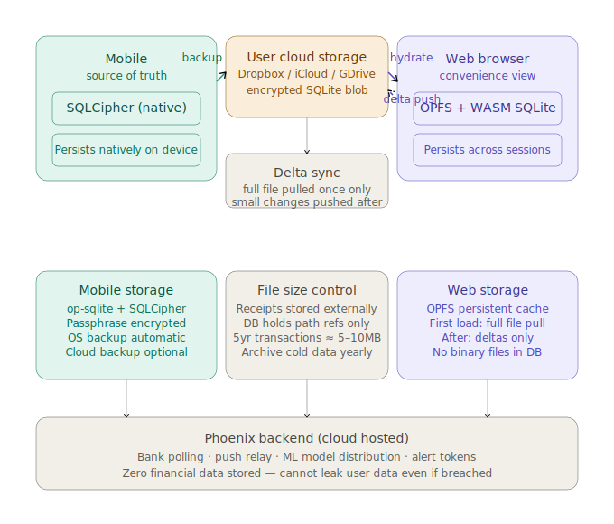

# Fresh

A privacy-first personal finance app. The central design guarantee is that **no financial data is ever stored on the server** — transaction history, amounts, and descriptions live exclusively in an encrypted on-device SQLite database.

The server knows you exist. It does not know what you spend.

---

## Architecture



**Mobile** is the source of truth. The encrypted SQLite file lives on the user's device and optionally backs up to their own cloud storage (Dropbox, iCloud Drive, or Google Drive) — Fresh servers never touch it. The **web app** is a convenience view: on first load it pulls the full encrypted blob from cloud storage into OPFS, then syncs deltas on subsequent visits. The **Phoenix backend** handles bank polling, push relay, and ML model distribution only — it cannot leak financial data because it never stores any.

---

## How it works

```
┌─────────────────────────────────────────────────────────────────┐
│                          Your Device                            │
│                                                                 │
│  ┌───────────────┐    ┌──────────────┐    ┌─────────────────┐  │
│  │  SQLite (enc) │    │  ONNX Model  │    │  React / RN UI  │  │
│  │  transactions │◄───│  categorizer │◄───│  dashboard      │  │
│  │  budgets      │    │  anomaly     │    │  transactions   │  │
│  │  rules        │    │  detector    │    │  budget         │  │
│  └───────┬───────┘    └──────┬───────┘    └────────┬────────┘  │
│          │                   │ weights               │          │
└──────────┼───────────────────┼───────────────────────┼──────────┘
           │ encrypted         │ CDN pull              │ API
           │ tx batch          │ on model:updated      │ calls
           ▼                   ▼                       ▼
┌──────────────────────────────────────────────────────────────┐
│                        Backend (Phoenix)                     │
│                                                              │
│  Stores: users, devices, sync schedules, model versions      │
│  Never stores: transactions, amounts, bank credentials       │
│                                                              │
│  ┌──────────────┐   ┌───────────┐   ┌──────────────────┐   │
│  │  SimpleFIN   │   │GoCardless │   │  Oban job queue  │   │
│  │  (US banks)  │   │ (EU banks)│   │  sync on schedule│   │
│  └──────┬───────┘   └─────┬─────┘   └──────────────────┘   │
│         └────────┬─────────┘                                │
│   encrypted ref  │  only — raw credentials never touch DB   │
└──────────────────┼──────────────────────────────────────────┘
                   │ anonymized feature vectors only
                   ▼
         ┌──────────────────┐       ┌──────────────┐
         │   ML Sidecar     │──────►│  R2 / MinIO  │
         │   (Python/FastAPI│ ONNX  │  model store │
         │   trains models) │       └──────────────┘
         └──────────────────┘
```

### Data flow

1. **Bank sync** — Oban schedules a sync job every 4 hours (configurable). The backend fetches raw transactions from SimpleFIN (US) or GoCardless (EU) using an encrypted access reference, then pushes an encrypted batch to the device over a Phoenix channel. The backend discards the raw data immediately after forwarding.

2. **On-device processing** — The device decrypts the batch, runs ONNX inference to categorize each transaction and flag anomalies, then writes results to its local SQLite database.

3. **ML training** — The sidecar trains models on anonymized feature vectors (hashed merchant names, bag-of-words, bucketed amounts — never raw data). It exports to ONNX, uploads weights to R2/MinIO, and signals the backend. The backend broadcasts `model:updated` via Phoenix channels; devices pull the new weights from the CDN.

---

## Repository layout

```
fresh/
├── apps/
│   ├── backend/          # Elixir/Phoenix API
│   ├── web/              # React web app (Vite)
│   └── mobile/           # React Native app (Expo)
├── packages/
│   ├── core/             # Shared TypeScript: DB client, ML inference, channel hooks
│   └── ui/               # Shared React component library
├── sidecar/              # Python FastAPI — ML training & model export (internal only)
├── docker-compose.yml
├── turbo.json
└── pnpm-workspace.yaml
```

### Backend domain modules (`apps/backend/lib/finapp/`)

| Module | Responsibility |
|---|---|
| `accounts/` | Users and devices |
| `sync/` | Bank adapters (SimpleFIN, GoCardless), sync jobs, Oban workers |
| `ml/` | Model version tracking, distribution worker |
| `vault.ex` | Cloak encryption for sensitive fields |

### What Postgres stores

| Table | Contents |
|---|---|
| `users` | Email, password hash, region (`us`/`eu`), timezone |
| `devices` | Device ID, push token, last seen |
| `sync_jobs` | Encrypted access ref, schedule (cron), last cursor |
| `model_versions` | ONNX model version, CDN path, checksum |

Postgres stores **no transactions, no amounts, no bank credentials in plaintext.**

---

## Getting started locally

### Prerequisites

- [Docker Desktop](https://www.docker.com/products/docker-desktop/)
- [Node.js](https://nodejs.org/) >= 20
- [pnpm](https://pnpm.io/) >= 9 — `npm install -g pnpm`
- Elixir >= 1.17 (only needed if running the backend outside Docker)

### 1. Start infrastructure and backend

```sh
docker compose up
```

This starts:
- **Postgres** on `localhost:5432`
- **Redis** on `localhost:6379`
- **Phoenix backend** on `localhost:4000`
- **ML sidecar** on the internal Docker network (not exposed externally)
- **MinIO** (local R2 substitute) on `localhost:9000`, console at `localhost:9001`

### 2. Install JS dependencies

```sh
pnpm install
```

### 3. Build the shared core package

```sh
pnpm --filter @fresh/core build
```

### 4. Start the web app

```sh
pnpm --filter @fresh/web exec vite
```

Open **http://localhost:5173**

### 5. Start the mobile app (optional)

```sh
pnpm --filter @fresh/mobile exec expo start
```

Follow the Expo CLI prompts to open on a simulator or physical device.

---

### Running everything in watch mode

To run the core package in watch mode alongside the web dev server (rebuilds on change):

```sh
pnpm turbo run dev
```

---

## Useful commands

| Command | Description |
|---|---|
| `docker compose up` | Start all services (Postgres, Redis, Phoenix, MinIO, ML sidecar) |
| `docker compose up -d postgres redis` | Start infrastructure only (for local backend dev) |
| `docker compose down` | Stop all services, keep volumes |
| `docker compose down -v` | Stop all services and wipe volumes |
| `pnpm install` | Install all JS dependencies |
| `pnpm --filter @fresh/core build` | Build shared core package |
| `pnpm turbo run build` | Build all packages |
| `pnpm turbo run dev` | Start all dev servers in watch mode |
| `pnpm turbo run test` | Run all frontend tests |
| `pnpm turbo run type-check` | Type-check all packages |
| `bin/test` | Run the full test suite (starts containers if needed) |

### Running tests

There are two ways to run the backend test suite:

**Option A — everything in Docker (simpler)**

```sh
docker compose up       # starts all services including the Phoenix backend
docker compose exec backend mix test
```

**Option B — backend running locally, infrastructure in Docker (faster iteration)**

```sh
docker compose up -d --wait postgres redis   # starts only postgres + redis
cd apps/backend
mix test
```

`mix test` automatically creates and migrates the `finapp_test` database on each run — no manual migration step needed. The `finapp_test` database is separate from `finapp_dev` so running tests never clobbers your local dev data.

For frontend tests no containers are needed:

```sh
pnpm --filter @fresh/web test
pnpm --filter @fresh/web type-check
```

**`bin/test` — run everything at once**

```sh
bin/test             # starts containers if needed, runs backend + frontend
bin/test --backend   # backend only
bin/test --frontend  # frontend only
```

### Backend (Elixir) — via Docker

```sh
# Run database migrations
docker compose exec backend mix ecto.migrate

# Reset the database
docker compose exec backend mix ecto.reset

# Open an IEx console
docker compose exec backend iex -S mix
```

### MinIO console

Visit **http://localhost:9001** (credentials: `minioadmin` / `minioadmin`) to inspect model weight storage.

---

## Debugging

See [docs/debugging.md](docs/debugging.md) for a full reference covering logs, CORS, database connections, pool exhaustion, and common error patterns.

---

## Bank integrations

**SimpleFIN** (US banks)
- User visits SimpleFIN Bridge and generates a one-time setup token
- App exchanges the token for a permanent access URL
- Only an encrypted reference to that URL is stored in Postgres

**GoCardless** (EU banks)
- App creates a requisition and redirects the user to their bank's auth page
- After authorization, only the encrypted account ID reference is stored

---

## Environment variables

`docker-compose.yml` provides all defaults for local development. For production, set:

| Variable | Description |
|---|---|
| `DATABASE_URL` | Postgres connection string |
| `SECRET_KEY_BASE` | Phoenix secret key base (`mix phx.gen.secret`) |
| `GUARDIAN_SECRET_KEY` | JWT signing key |
| `CLOAK_KEY_BASE64` | Base64-encoded AES-256 key for field encryption |
| `REDIS_URL` | Redis connection string |
| `ML_SIDECAR_URL` | Internal URL of the ML sidecar |
| `CDN_BASE_URL` | Public base URL for model weight downloads |
| `SIDECAR_TOKEN` | Shared secret between backend and ML sidecar |
| `R2_ENDPOINT_URL` | Cloudflare R2 (or MinIO) endpoint |
| `R2_BUCKET` | Bucket name for model weights |
| `R2_ACCESS_KEY_ID` | R2 access key |
| `R2_SECRET_ACCESS_KEY` | R2 secret key |
